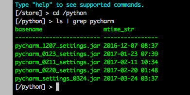

NutStore CLI
============

|VERSION| |PYVERSION|

坚果云 WebDAV 命令行工具

A command-line interface for `NutStore`_ based on WebDAV.

Inspired by `http-prompt`_.

Screenshot
-----------

https://asciinema.org/a/T0AwPltSoPZYSYQ7OHQng15rg

Install
-------

**Only works on Python2.7 now**

.. code::

    $ pip install nutstore-cli

Usage
-----

.. code::

    $ nutstore-cli --help

How to setup WebDAV on NutStore
-------------------------------

https://github.com/Kxrr/nutstore-cli/blob/master/docs/tutorial.md

Environment Variable
^^^^^^^^^^^^^^^^^^^^

* NUTSTORE_USERNAME
* NUTSTORE_KEY
* NUTSTORE_WORKING_DIR

.. |PYVERSION| image:: https://img.shields.io/badge/python-2.7-blue.svg
.. |VERSION| image:: https://img.shields.io/badge/version-0.3.4-blue.svg

.. _NutStore: https://www.jianguoyun.com
.. _http-prompt: https://github.com/eliangcs/http-prompt

