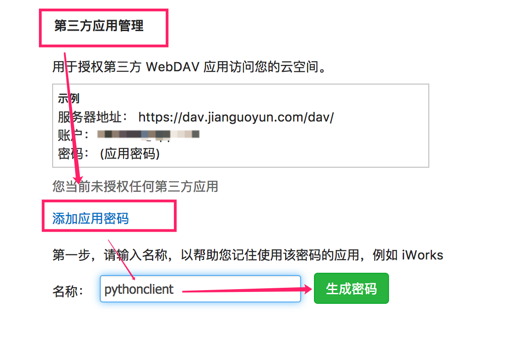
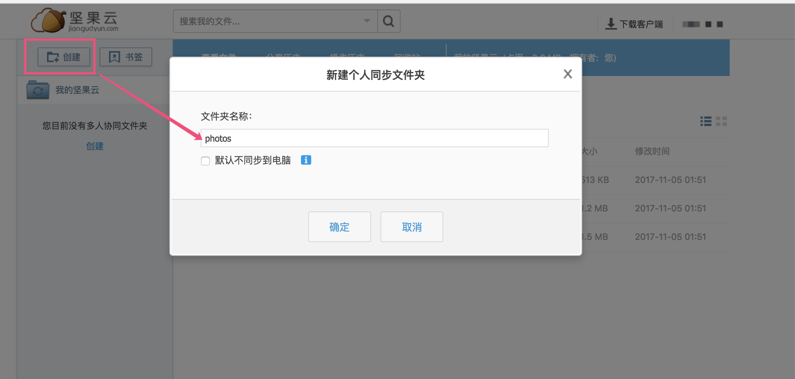

# How to setup Nutstore WebDAV

如何在坚果云中开启 WebDAV 支持

1. Register a Nutstore account

    If you don't have a Nutstore account, register one here:
    https://www.jianguoyun.com/d/signup

    * Let's assume your new account's username is `a@example.com`


2. Enable WebDAV in Nutstore Setting, get the WebDAV key

    * Visit: https://www.jianguoyun.com/d/account#safe
    * Setup like the image below

    

    * Now you should have your WebDAV key

    

    * As you can see, my WebDAV key is `ah2fxzeki48kw2xh`

3. Make a new directory on Nutstore

    * Your will see making directory button here: https://www.jianguoyun.com/

    

    Now you have a directory named `photos`

4. Use nutstore-cli now

   * Until now, ou have `username`,  `WebDAV key` and `new directory name`
   * You can start nutstore-cli with:

   ```
   $ nutstore-cli --username a@example.com --key ah2fxzeki48kw2xh --working_dir /photos
   ```


    * Enjoy!
